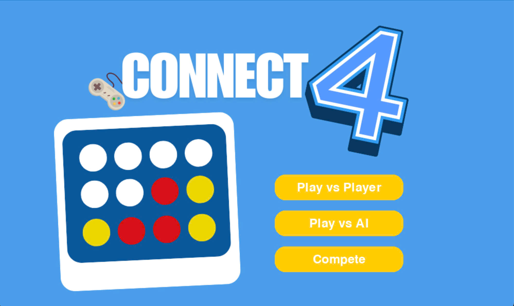
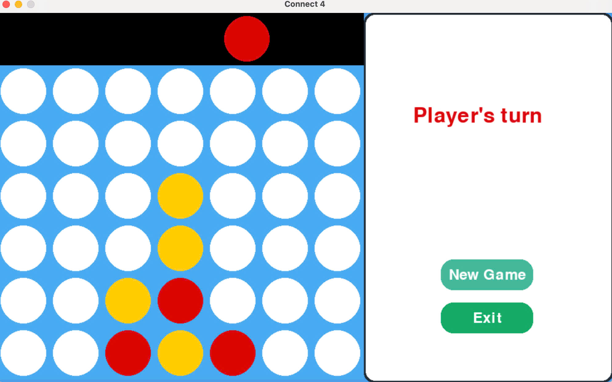

# Connect4
 # Connect4 - Bài tập lớn môn Trí tuệ nhân tạo - Nhóm 13

**Connect4** là một dự án triển khai trò chơi Connect Four được viết bằng ngôn ngữ **Python**, tích hợp **AI sử dụng thuật toán Minimax kết hợp cắt tỉa Alpha-Beta**, cùng với một FastAPI backend để cung cấp chức năng AI qua REST API giành cho chế độ AI thi đấu với các nhóm khác. Game cung cấp trải nghiệm chơi đa dạng với các chế độ **Người vs Người (Player vs Player)** và **Người vs Máy (Player vs AI)**.

**Các thành viên**
- Hoàng Thị Thanh Nga – MSV: 23021647
- Nguyễn Thị Thương – MSV: 23021734
- Bùi Thu Phương – MSV: 23021667
- Nguyễn Mai Thanh Thư – MSV: 23021731

---

## 🚀 Tính năng nổi bật

- 🎮 **Chế độ chơi linh hoạt:**
  - **Player vs Player:** Hai người chơi đối đầu trực tiếp.
  - **Player vs AI:** Người chơi đấu với AI sử dụng Minimax cải tiến.

-  **AI thông minh:**
  - Thuật toán **Minimax** với **Alpha-Beta Pruning**.
  - **Sắp xếp nước đi (Move Ordering)** giúp tối ưu hóa lựa chọn.
  - **Phát hiện nước thắng** tức thì và **tránh nước thua ngay**.
  - **Hàm đánh giá heuristic** dựa trên vị trí, số lượng quân liên tiếp.

- 🌐 **FastAPI Backend:**
  - Dùng để xử lý chế độ thi đấu giữa các nhóm AI qua REST API.

- 📟 **Giao diện dòng lệnh:** Menu đơn giản để chọn chế độ chơi và tương tác.

---

## 🖼️ Giao diện trò chơi

Trò chơi hỗ trợ giao diện trực quan, dễ sử dụng với các chế độ được hiển thị rõ ràng.

### 🌟 Màn hình chính



### 🤖 Chế độ chơi Người vs Người hoặc Người chơi vs AI 



---

## 🗂️ Cấu trúc dự án

```plaintext
connect4-ai/
├── menu.py              # Giao diện menu chính, chọn chế độ chơi
├── connect4_utils.py    # Chứa các tiện ích cốt lõi để quản lý bảng trò chơi (khởi tạo, thả đĩa, kiểm tra thắng).
├── connect4_no_ai.py    # Triển khai chế độ Người vs Người (Player vs Player)
├── connect4_ai.py       # Triển khai chế độ Người vs Máy (Player vs AI)
├── app.py               # Thuật toán AI + API phục vụ chế độ thi đấu nhóm
├── images/              # Thư mục chứa ảnh minh họa giao diện
└── README.md            # Tài liệu mô tả dự án
